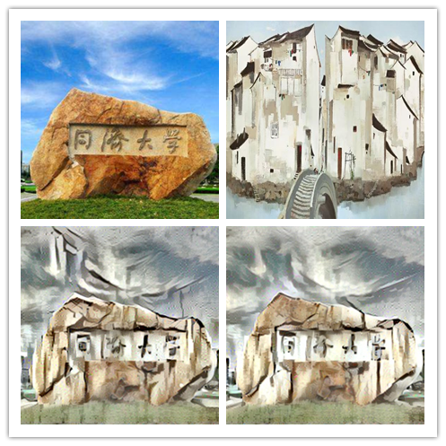
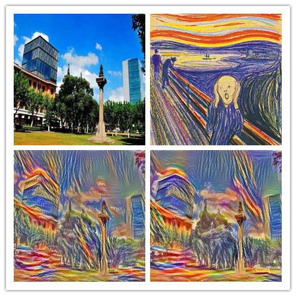
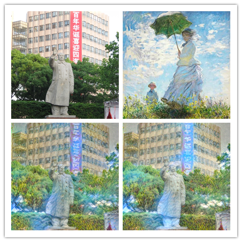

# Deep Convolutional Style Transfer Network
A tensorflow implementation of style transfer.

>   In an attempt to learn Tensorflow I've implemented an deep convolutional styletransformation network as described in << A neural algorithm of artistic style >> by Gatys et al.  

This code is based on [OlavHN/fast-neural-style](https://github.com/OlavHN/fast-neural-style).

*****

Style image: starry  
---

 

Content imgae: Tongji University
---

 

---
Result 1: iteration = 500
---

 

Result 2: iteration 1000
---

 

###
 Style: East of China
 ---
 
 

###
Style: Scream
---

 

###
Style: Colorful
---

 

###
Style: The woman with the parasol
---

 

###
Running
---
    python neural_style.py --content <content file> --styles <style file> --output <output file>

Use --iterations to change the number of iterations (default 1000).

###
Requirements and Prerequisites:
---
* Python 2.7.x
* Tensorflow >= 1.0
