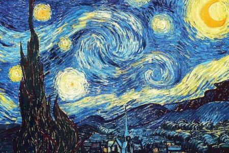
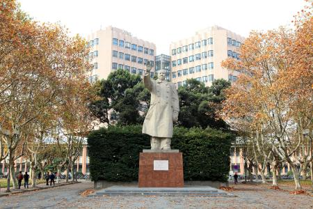
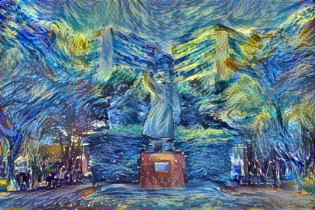
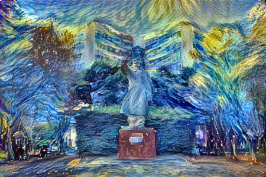

# Deep Convolutional Style Transfer Network
A tensorflow implementation for style transfer.

    In an attempt to learn Tensorflow I've implemented an Image Transformation Network as described in 
    Perceptual Losses for Real-Time Style Transfer and Super-Resolution by Johnson et al.

This code is based on [OlavHN/fast-neural-style](https://github.com/OlavHN/fast-neural-style).

*****

>   In an attempt to learn Tensorflow I've implemented an Image Transformation Network as described in Perceptual Losses for Real-Time Style Transfer and Super-Resolution by Johnson et al.

 

------
This picture with iteration = 500

This picture with iteration = 1000

    python eval.py --model_file <your path to wave.ckpt-done> --image_file img/test.jpg

Then copy it to the folder pretrained/ :

    cd <this repo>
    mkdir pretrained
    cp <your path to vgg_16.ckpt>  pretrained/

`linux` `网络编程` `socket` `epoll` 
