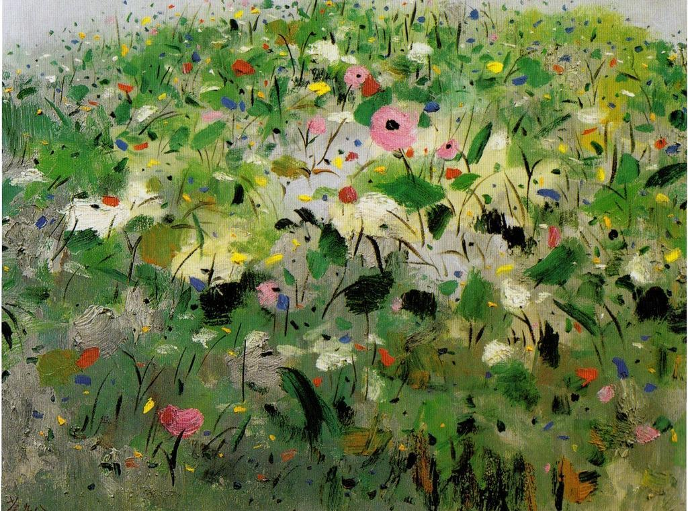
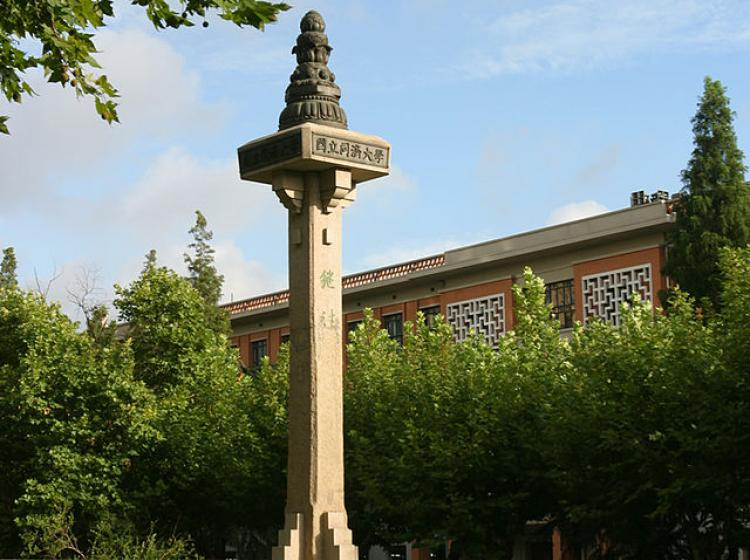
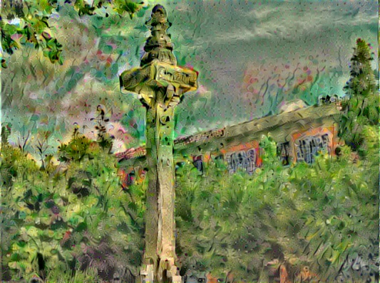

# Deep Convolutional Style Transfer Network
A tensorflow implementation for style transfer.

    In an attempt to learn Tensorflow I've implemented an Image Transformation Network as described in 
    Perceptual Losses for Real-Time Style Transfer and Super-Resolution by Johnson et al.

This code is based on [OlavHN/fast-neural-style](https://github.com/OlavHN/fast-neural-style).

*****

>   In an attempt to learn Tensorflow I've implemented an Image Transformation Network as described in Perceptual Losses for Real-Time Style Transfer and Super-Resolution by Johnson et al.

 

---
iteration = 500
---

iteration = 1000
---

    python eval.py --model_file <your path to wave.ckpt-done> --image_file img/test.jpg

style image: Lotus

  

content imgae: Tongji University

  

iteration = 500
---

iteration = 1000
---

