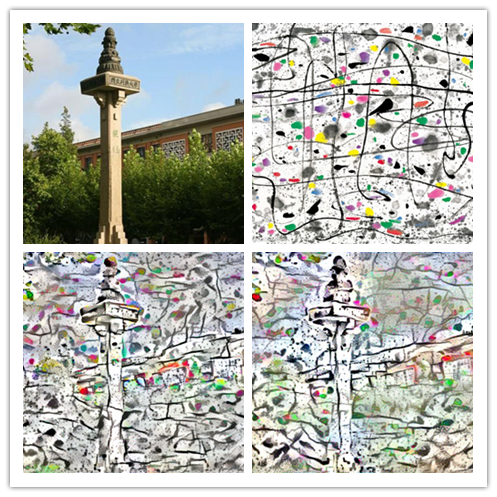

# Deep Convolutional Style Transfer Network
A tensorflow implementation for style transfer.

    In an attempt to learn Tensorflow I've implemented an Image Transformation Network as described in 
    Perceptual Losses for Real-Time Style Transfer and Super-Resolution by Johnson et al.

This code is based on [OlavHN/fast-neural-style](https://github.com/OlavHN/fast-neural-style).

*****

>   In an attempt to learn Tensorflow I've implemented an Image Transformation Network as described in Perceptual Losses for Real-Time Style Transfer and Super-Resolution by Johnson et al.

Style image: starry  
---

 

Content imgae: Tongji University
---

 

---
With iteration 500
---

 

With iteration 1000
---

 

###
 Style: East of China
 ---
 
 

###
Style: Scream
---

 

###
Style: Colorful
---

 

###
Style: Lover
---

 

###
Running
    python eval.py --model_file <your path to wave.ckpt-done> --image_file img/test.jpg

Use --iterations to change the number of iterations (default 1000).

###
Requirements and Prerequisites:

* Python 2.7.x
* Tensorflow >= 1.0
